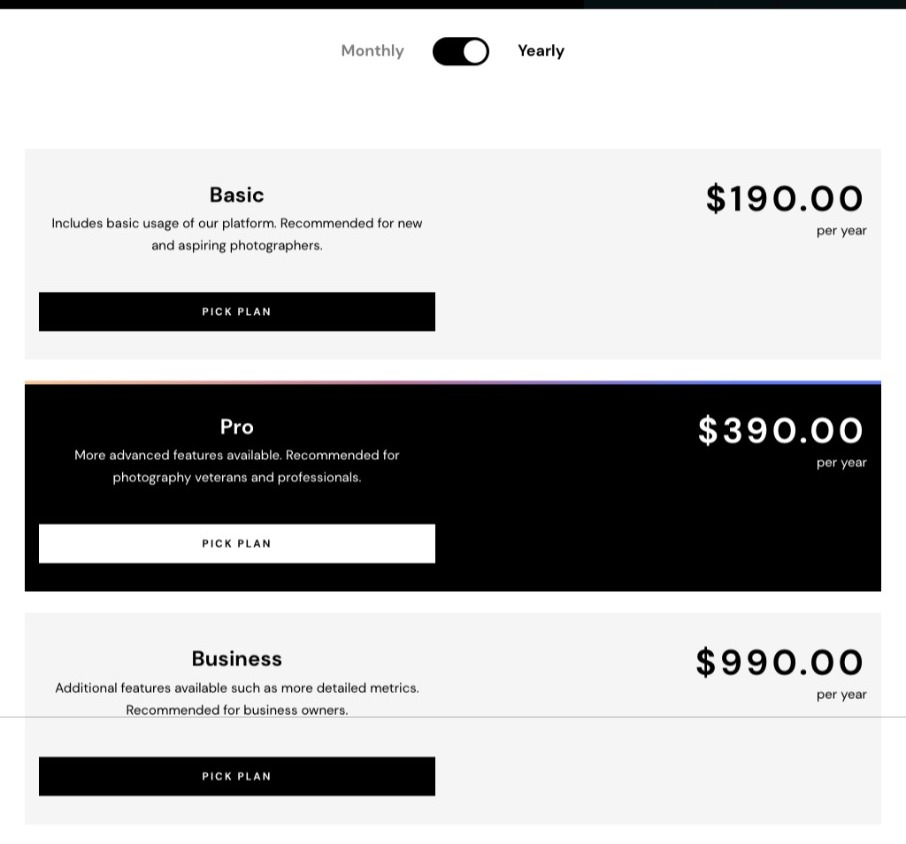
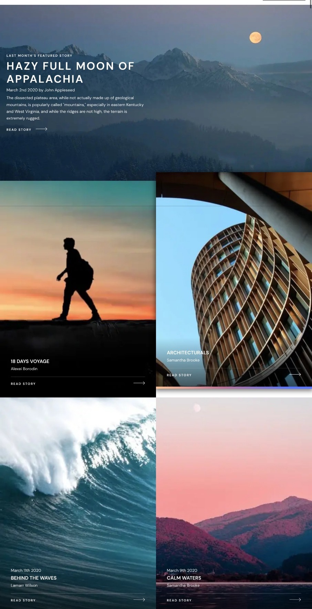
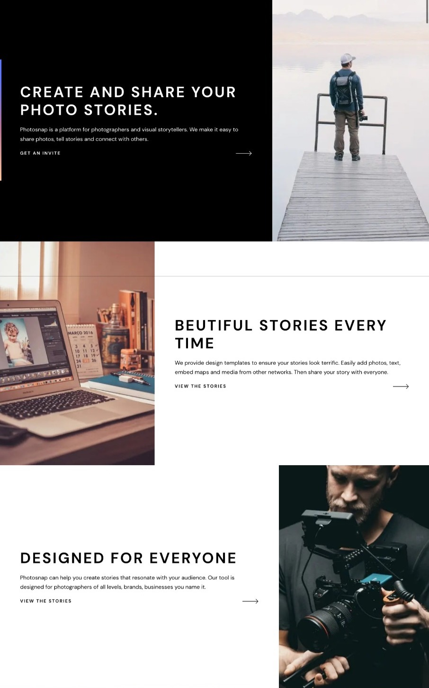
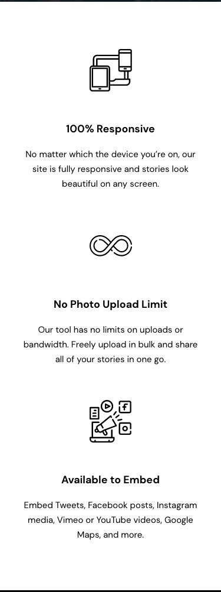
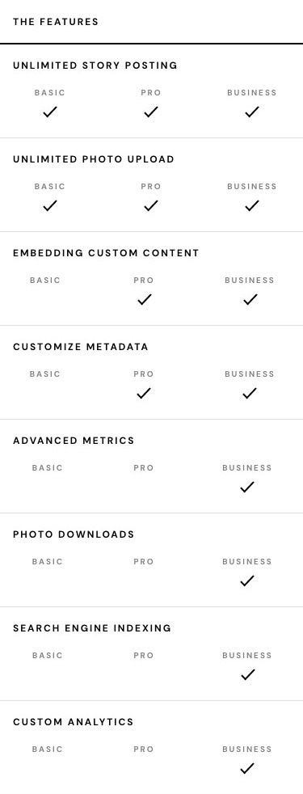
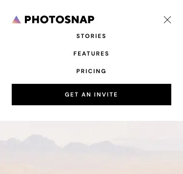

# Photosnap <!-- omit from toc -->

The Photosnap Website project is a solution to a challenge provided by Frontend Mentor, which aimed to improve coding skills by building a realistic project. This project was a valuable experience in trying new things, strengthening existing skills, and discovering new technologies. A significant part of the project involved thinking in terms of React components, as most parts of the site were built as reusable components. The challenge also emphasized proper data management, prompting the creation of a JSON file to dynamically feed data into the components instead of hardcoding it.

## Table of contents <!-- omit from toc -->

- [Overview](#overview)
	- [The challenge](#the-challenge)
	- [Screenshot](#screenshot)
	- [Links](#links)
- [My process](#my-process)
	- [Built with](#built-with)
	- [What I learned](#what-i-learned)
	- [Continued development](#continued-development)
	- [Useful resources](#useful-resources)
- [Author](#author)

## Overview

### The challenge

The primary challenge was to build a fully responsive version of the Photosnap website, ensuring that it displayed optimally across various device screen sizes. The goal was to make every interactive element on the site respond appropriately to user interaction, such as hover and active states.

In addition to the given challenge, the project was taken a step further by implementing it in React. This allowed for components to be reusable, which significantly streamlined the development process. A particularly challenging component was the pricing page, which involved working with tables and required special attention for mobile layouts.

One of the notable accomplishments of the project was successfully implementing a toggle button with minimal JavaScript. The state management was handled with JavaScript, but the click and animation were achieved purely with CSS and HTML input elements. This was a result of learning from WebDev Simplified's video on toggle buttons, experimenting, and finding an efficient solution.

### Screenshot







### Links

- Solution URL: [View solution URL here](https://www.frontendmentor.io/solutions/react-photosnap-website-i-also-made-ajson-if-anyone-wants-it-chiQvIeNhj)
- Live Site URL: [View live site URL here](https://photosnap-multipage-website-fem.vercel.app/)

## My process

### Built with

This project was primarily built using the following technologies:

- Next.js 13 (React framework)
- React.js
- SCSS
- JSON

Next.js 13, a popular React framework, was used to build the application. It offers features like server-side rendering and generating static websites, which can improve performance and SEO.

React.js was utilized for its component-based architecture, which significantly streamlined the development process and improved code maintainability.

SCSS, a CSS preprocessor, was used for styling. This was a new technology introduced in this project, and it was chosen over Tailwind CSS due to its preprocessing capabilities.

JSON was used for data management. Instead of hardcoding data into the components, a JSON file was created to dynamically feed data into them. This approach made it easy to update and make adjustments as needed.

### What I learned

This project was a significant learning experience in several ways:

- React and Next.js: The project offered an opportunity to deepen understanding of React, particularly the use of components. Implementing the project using Next.js 13 helped to gain experience with this popular React framework and its powerful features like server-side rendering and generating static websites.

- SCSS: Being introduced to SCSS, a CSS preprocessor, was a key learning aspect. Using SCSS over Tailwind CSS, due to its preprocessing capabilities, helped in gaining practical experience with this technology.

- Data Management with JSON: The project necessitated managing data dynamically rather than hardcoding it into components. This led to the creation of a JSON file to feed data into the components, a learning experience that emphasized the importance and efficiency of proper data management.

- Animations and Interactivity: A notable accomplishment was the successful implementation of a toggle button with minimal JavaScript, where the click and animation were achieved purely with CSS and HTML input elements. Here's the SCSS code for the toggle button:

```scss
.toggle {
	position: relative;
	width: 4rem;
}

.toggle::before {
	position: absolute;
	content: "";
	width: 4rem;
	height: 2rem;
	background-color: $clr-gray-light;
	border-radius: 100vw;
	transition: background-color 300ms ease-in-out;
}

.toggle:checked::before {
	background-color: $clr-black;
}

.toggle::after {
	position: absolute;
	content: "";
	left: 0;
	width: 2rem;
	height: 2rem;
	scale: 0.8;
	background-color: $clr-black;
	border-radius: 100vw;
	transition: all 300ms ease-in-out;
}

.toggle:checked::after {
	left: 2rem;
	background-color: $clr-white;
}

.toggle:focus-visible {
	outline: none;
}
```

### Continued development

Going forward, there are several areas that I'd like to further develop in my future projects:

- Component Design: This project was a great exercise in thinking in components. I'd like to continue developing this mindset, building reusable components and striving for efficient, modular code.

- SCSS Mastery: This project was my introduction to SCSS. I'm looking forward to learning more about this powerful CSS preprocessor, including mixins, functions, and best practices for organization and nesting.

- Data Management: The approach to data management in this project — creating a JSON file to feed data into the components — was efficient and flexible. I want to continue exploring best practices for dynamic data handling in React.

- Advanced React Hooks: There are still many React hooks that I haven't fully explored. In future projects, I aim to delve deeper into hooks like useContext, useReducer, and custom hooks.

- Next.js Features: Working with Next.js 13 was a valuable experience. I'm excited to explore more of its features, like API routes, automatic static optimization, and built-in CSS support.

### Useful resources

- [Frontend Mentor:](https://www.frontendmentor.io/challenges/photosnap-multipage-website-nMDSrNmNW) This Photosnap Website challenge was the basis for this project. Frontend Mentor challenges are a great way to improve your coding skills by building realistic projects.

- [WebDev Simplified's Toggle Button Video:](https://youtu.be/N8BZvfRD_eU) This video on creating a toggle button was very useful. Although I only watched the first half before trying things out on my own, it gave me a good starting point for creating the toggle button in this project.

## Author

- Github - [@blazeshomida](https://github.com/blazeshomida)
- Frontend Mentor - [@shomidamoney](https://www.frontendmentor.io/profile/shomidamoney)
